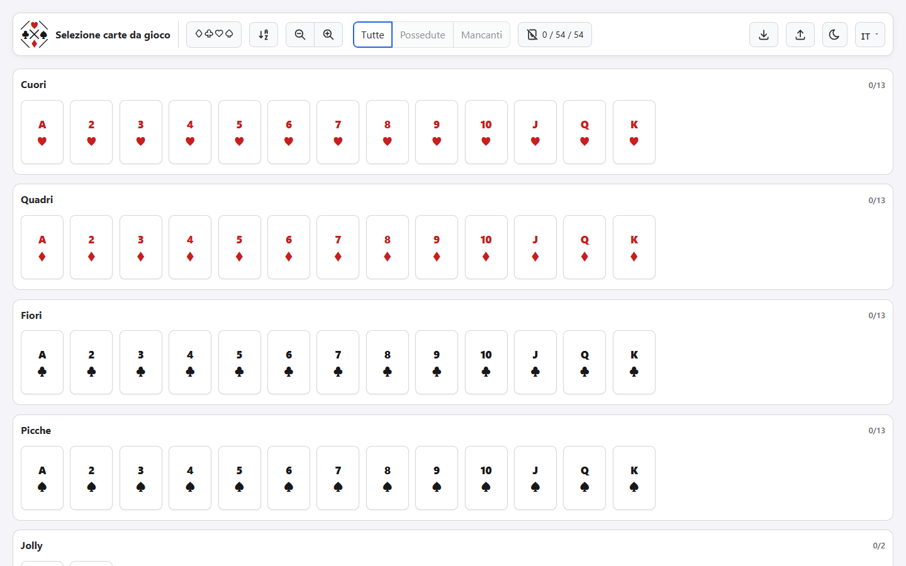

# Playing Card Selector

A fast, private tracker for a standard playing-card collection. Mark the cards you own, group and
filter the deck, and keep a portable backup of your collection.

[Open Playing Card Selector](https://melnorme6.github.io/playing-card-selector/)



## Features

- Tracks a complete deck: 52 standard cards plus two jokers.
- Groups cards by suit or value, with ascending and descending order.
- Filters owned and missing cards.
- Locks card editing to prevent accidental collection changes.
- Offers three card sizes with accessible zoom controls.
- Stores the collection, language, theme, and editing-lock preference locally in the browser.
- Imports and exports versioned, human-readable JSON backups.
- Includes light and dark themes.
- Supports keyboard navigation and responsive card wrapping on narrow screens.
- Uses no framework, account, analytics, tracking, external font, CDN, or third-party script.

## Use online

The recommended way to use the application is the hosted
[GitHub Pages version](https://melnorme6.github.io/playing-card-selector/). It runs entirely in the
browser and requires no installation.

## Use offline

Download the latest portable archive from
[GitHub Releases](https://github.com/melnorme6/playing-card-selector/releases/latest), extract it,
and open `index.html` in a current browser.

Opening the application directly from the filesystem normally works, but browser behavior for
`localStorage` on `file:` URLs is not standardized. Export regular JSON backups if you use the
offline version. For fully predictable persistence, use the hosted version or serve the files over
HTTP.

## Supported browsers

The application targets current stable versions of Chrome, Firefox, Edge, and Safari.

## Privacy and backups

Collection data never leaves your browser. The application contains no analytics or tracking and
does not send selected cards, imported files, language, or theme settings to GitHub or any third
party. A restrictive Content Security Policy also prevents the application JavaScript from making
network connections.

The collection, language, theme, and card-editing lock are stored using `localStorage`. Use
**Export JSON** to create a portable backup and **Import JSON** to restore it. Legacy card-only
exports remain supported and preserve the current language and theme.

An exported backup contains only its schema version, selected card identifiers, language, and
theme. It contains no account identifier, email address, browser identifier, or analytics data.

The hosted version is delivered by GitHub Pages. Like any hosting provider, GitHub receives ordinary
connection information needed to serve the site, such as an IP address and browser request data,
under the [GitHub General Privacy Statement](https://docs.github.com/en/site-policy/privacy-policies/github-general-privacy-statement).
This connection information does not include the collection stored by the application.

Private or incognito browsing may delete locally stored data when the browsing session ends.

## Languages

The interface is available in:

- English
- Italian
- Brazilian Portuguese
- Latin American Spanish
- German
- French
- Russian
- Turkish
- Simplified Chinese
- Traditional Chinese
- Japanese
- Korean

Translations were created with AI assistance and reviewed for terminology, consistency, and
interface completeness. Translation errors can be reported through
[GitHub Issues](https://github.com/melnorme6/playing-card-selector/issues).

## Local development

No installation or build step is required. From the repository root, start any static HTTP server,
for example:

```bash
python -m http.server 8000
```

Then open `http://localhost:8000`.

Run the dependency-free automated checks with a current Node.js version:

```bash
node --test tests/app.test.mjs
```

## Project layout

```text
.
├── index.html                 # Application structure and local SVG sprite
├── assets/css/styles.css      # Responsive styles and themes
├── assets/js/app.js           # State, persistence, import/export, localization, and UI
├── docs/images/               # Public repository screenshots
├── tests/app.test.mjs         # Dependency-free static and data-model tests
└── .github/workflows/         # Pages deployment and release packaging
```

## Support and security

Use [GitHub Issues](https://github.com/melnorme6/playing-card-selector/issues) for reproducible bugs
and translation problems. Please do not report security vulnerabilities in a public issue; follow
the instructions in [SECURITY.md](SECURITY.md).

## Forking

This repository does not accept pull requests. You are welcome to fork the project and adapt it
under the terms of the MIT License. Preserve the license and third-party notices in redistributed
copies.

## License

Playing Card Selector is distributed under the [MIT License](LICENSE).

The interface includes icons from Tabler Icons. Their attribution and license are documented in
[NOTICE](NOTICE).
